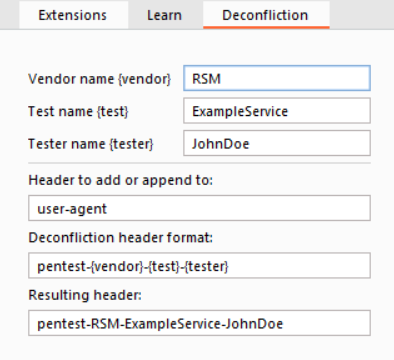

# Burp Suite Deconfliction
This Burp Suite extension is designed to append deconfliction information to all outgoing requests. This is crucial for accurate attribution and differentiation of penetration testing activities from other traffic. While Burp Suite's built-in match and replace feature can perform a similar function, it has limitations. For instance, in the Proxy tab, users must manually switch to the "Auto-modified Request" to see changes. Additionally, any requests crafted in the Repeater will not include modifications unless added manually. This extension automates these processes, reducing the likelihood of human error and ensuring consistent application of deconfliction information.

# Installation
- Download the latest jar file from https://github.com/rsmusllp/BurpSuiteDeconfliction/releases
- In Burp Suite, navigate to "Extender" -> "Extensions" -> "Add", and choose the downloaded file.

# Usage
- Access the "Deconfliction" tab for a range of configuration options.
- All settings are saved automatically on a per-user basis.
- Note: The test name is specifically saved on a per-project basis.

# Bug Reporting
Your input on any encountered bugs is invaluable. To report:
- Create an issue with a clear description of how to reproduce the bug.
- Include any relevant error messages from the extender error log.